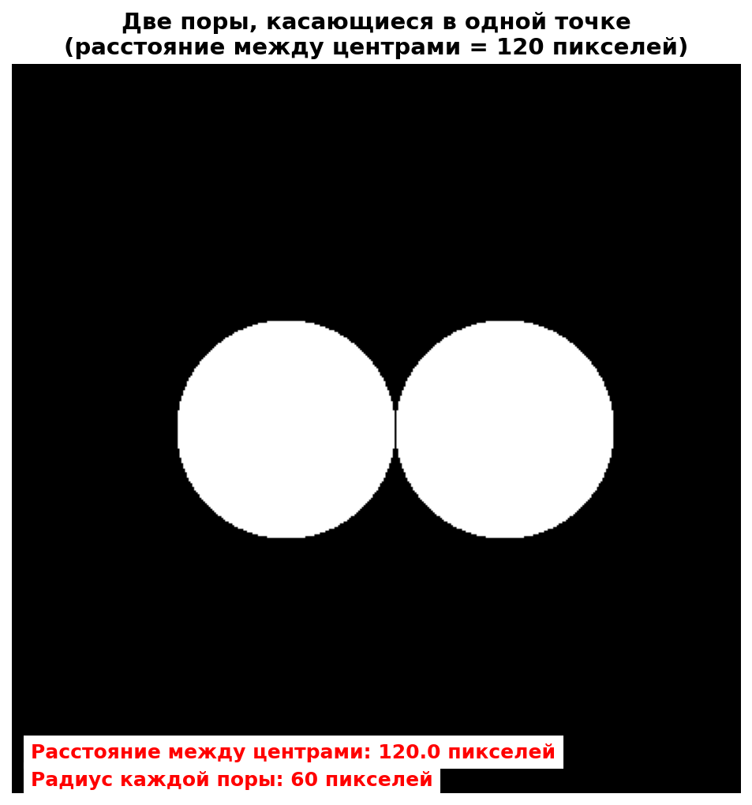
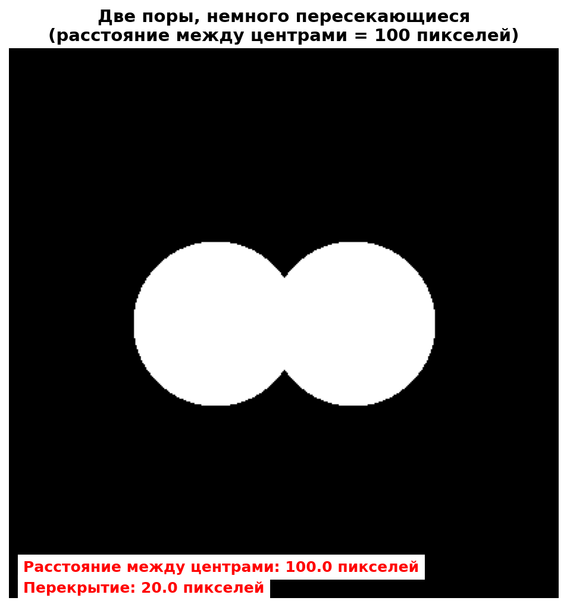
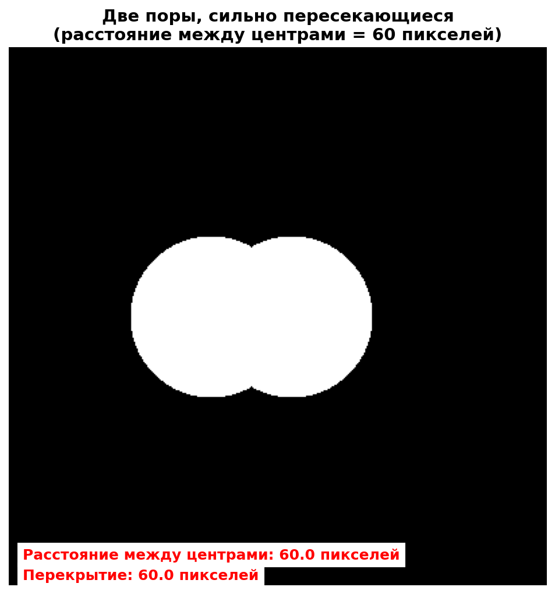

# Подсистема аппроксимации сложных морфологических объектов на основе генетического алгоритма

Программная подсистема для аппроксимации сложных морфологических объектов набором геометрических примитивов с использованием **генетического алгоритма**.

Проект разработан в рамках выпускной квалификационной работы по теме:

> **«Подсистема аппроксимации сложных морфологических объектов на основе генетического алгоритма»**

Основная рассматриваемая задача — анализ бинарных изображений микроструктур и аппроксимация сложных объектов, в том числе образованных несколькими слипшимися или пересекающимися порами.

В текущей версии программы в качестве аппроксимирующих примитивов используются **окружности**.

---

## О проекте

При анализе изображений микроструктур отдельные поры могут соприкасаться или пересекаться, вследствие чего стандартные методы анализа связных компонент воспринимают несколько объектов как один сложный морфологический объект.

Разработанная подсистема решает задачу представления такого объекта в виде набора окружностей.

Для поиска параметров окружностей используется генетический алгоритм, оптимизирующий:

* координаты центров окружностей;
* радиусы окружностей;
* степень покрытия исходного объекта;
* площадь выхода аппроксимации за границы объекта;
* площадь непокрытой области;
* степень перекрытия окружностей.

Качество результата оценивается прежде всего с использованием метрики **IoU (Intersection over Union)**.

---

## Основные возможности

* загрузка и предварительная обработка изображений;
* преобразование изображений в бинарные маски;
* выделение крупнейшей связной компоненты;
* построение карты расстояний `Distance Transform`;
* автоматический поиск перспективных начальных центров окружностей;
* формирование начальной популяции генетического алгоритма;
* случайная и направленная инициализация особей;
* турнирная селекция с элитизмом;
* одноточечный кроссовер;
* адаптивная мутация;
* локальная оптимизация лучшего решения;
* вычисление IoU;
* штраф за выход окружностей за границы объекта;
* штраф за непокрытые области;
* контроль взаимного перекрытия окружностей;
* подбор оптимального количества окружностей;
* проведение серии экспериментальных запусков;
* визуализация результатов;
* построение графиков сходимости генетического алгоритма;
* экспорт параметров найденных окружностей и метрик в JSON.

---

## Принцип работы

Общий алгоритм работы подсистемы состоит из нескольких этапов.

### 1. Загрузка изображения

Пользователь выбирает одно из изображений, находящихся в каталоге проекта.

Поддерживаются форматы:

* PNG;
* JPG / JPEG;
* TIFF;
* BMP.

### 2. Предварительная обработка

Исходное изображение преобразуется в полутоновое представление, после чего выполняются:

* адаптивная пороговая обработка;
* удаление небольших объектов;
* заполнение небольших отверстий;
* морфологическое замыкание;
* морфологическое размыкание;
* поиск связных компонент.

Для дальнейшей обработки выбирается крупнейшая связная компонента.

### 3. Построение карты расстояний

Для бинарной маски вычисляется **Euclidean Distance Transform**.

Значение каждого пикселя карты показывает расстояние от него до ближайшей границы объекта.

Локальные максимумы карты расстояний используются в качестве предполагаемых центров исходных пор и позволяют выполнить направленную инициализацию генетического алгоритма.

### 4. Формирование начальной популяции

Каждая особь генетического алгоритма представляет собой набор окружностей:

```text
[x1, y1, r1, x2, y2, r2, ..., xn, yn, rn]
```

где:

* `x` — координата центра окружности по горизонтали;
* `y` — координата центра окружности по вертикали;
* `r` — радиус окружности.

Часть популяции создаётся на основе найденных локальных максимумов карты расстояний, а оставшиеся особи формируются случайным образом.

### 5. Генетическая оптимизация

На каждой итерации выполняются основные операции генетического алгоритма:

1. вычисление функции приспособленности;
2. турнирная селекция;
3. сохранение элитных особей;
4. кроссовер;
5. адаптивная мутация;
6. формирование нового поколения.

После завершения эволюционного цикла для лучшей найденной особи дополнительно применяется локальный поиск.

### 6. Оценка результата

Основной метрикой качества является:

### Intersection over Union

```text
IoU = Intersection / Union
```

где:

* `Intersection` — площадь пересечения исходного объекта и построенной аппроксимации;
* `Union` — суммарная площадь их объединения.

Чем ближе значение IoU к `1.0`, тем точнее построенная аппроксимация соответствует исходной форме.

Дополнительно функция приспособленности учитывает штрафы за:

* лишнюю площадь;
* непокрытую площадь;
* взаимное перекрытие окружностей;
* нежелательные значения радиусов;
* сложные случаи множественного перекрытия.

### 7. Выбор количества окружностей

Пользователь задаёт минимальное и максимальное количество окружностей для исследования.

Программа последовательно выполняет оптимизацию для каждого значения `N` и выбирает решение с наибольшим IoU.

---

## Технологический стек

Проект реализован на языке **Python**.

Основные библиотеки:

* **NumPy** — численные вычисления и работа с массивами;
* **SciPy** — вычисление карты расстояний и вспомогательные алгоритмы;
* **scikit-image** — обработка изображений, морфологические операции и анализ связных компонент;
* **Matplotlib** — визуализация результатов и графиков;
* **Pandas** — обработка результатов экспериментальных исследований.

---

## Структура репозитория

```text
Ellipse_Approximator_v2/
│
├── circle_approximator.py
├── create_circle_masks.py
├── research_overlap_threshold.py
├── utils.py
├── requirements.txt
├── README.md
│
├── single_pore.png
├── touching_pores.png
├── slightly_overlapping_pores.png
├── highly_overlapping_pores.png
├── three_*.png
├── four_*.png
│
└── DD.MM.YYYY/
    └── результаты экспериментальных запусков
```

### `circle_approximator.py`

Основной модуль проекта.

Содержит реализацию:

* предварительной обработки;
* генетического алгоритма;
* функции приспособленности;
* операций селекции, кроссовера и мутации;
* локального поиска;
* оценки качества;
* визуализации;
* экспорта результатов.

Основной класс:

```python
CircleGeneticApproximator
```

### `create_circle_masks.py`

Генератор синтетических тестовых изображений.

Позволяет создавать различные конфигурации пор:

* одиночную пору;
* две касающиеся поры;
* две частично перекрывающиеся поры;
* две сильно перекрывающиеся поры;
* конфигурации из трёх пор;
* конфигурации из четырёх пор.

Такие изображения используются для контролируемого экспериментального исследования алгоритма.

### `research_overlap_threshold.py`

Модуль для экспериментального исследования зависимости результатов работы алгоритма от расстояния между объектами и степени их взаимного перекрытия.

Позволяет автоматически выполнять серию экспериментов и сохранять полученные показатели.

### `utils.py`

Набор вспомогательных функций для анализа характеристик морфологических объектов и визуализации экспериментальных данных.

### Каталоги с датами

Каталоги вида:

```text
09.01.2026/
10.01.2026/
11.01.2026/
...
```

содержат результаты экспериментальных запусков программы, выполненных в процессе разработки и исследования алгоритма.

---

## Установка

### 1. Клонирование репозитория

```bash
git clone https://github.com/Waravie-prog/Ellipse_Approximator_v2.git
cd Ellipse_Approximator_v2
```

### 2. Создание виртуального окружения

Рекомендуется использовать отдельное виртуальное окружение.

#### Windows

```bash
python -m venv venv
venv\Scripts\activate
```

#### Linux / macOS

```bash
python3 -m venv venv
source venv/bin/activate
```

### 3. Установка библиотек

```bash
pip install numpy scipy scikit-image matplotlib pandas
```

---

## Запуск основной программы

В корневом каталоге проекта выполните:

```bash
python circle_approximator.py
```

После запуска программа:

1. найдёт доступные изображения;
2. выведет их список;
3. предложит выбрать изображение;
4. запросит минимальное количество окружностей;
5. запросит максимальное количество окружностей;
6. выполнит оптимизацию для каждого значения `N`;
7. выберет вариант с максимальным IoU;
8. сохранит результаты эксперимента.

Например:

```text
ДОСТУПНЫЕ ИЗОБРАЖЕНИЯ:

1. single_pore.png
2. touching_pores.png
3. slightly_overlapping_pores.png
4. highly_overlapping_pores.png

Выберите изображение: 3

Минимальное количество окружностей для тестирования: 1
Максимальное количество окружностей для тестирования: 4
```

---

## Генерация тестовых изображений

Для создания набора синтетических тестовых масок используется:

```bash
python create_circle_masks.py
```

Скрипт формирует изображения с различным количеством пор и различной степенью их взаимного перекрытия.

Пример тестовой конфигурации:



Пример частичного перекрытия:



Пример сильного перекрытия:



---

## Результаты работы

Для каждого запуска создаётся отдельный каталог результатов.

Название содержит дату и время запуска:

```text
DD.MM.YYYY/
└── final_<имя_изображения>_<timestamp>/
```

В него сохраняются основные результаты исследования.

### Визуализация аппроксимации

```text
<image>_main_result.png
```

Изображение содержит:

1. исходную бинарную маску;
2. результат аппроксимации окружностями;
3. карту ошибки между исходным и аппроксимированным объектом.

### Графики сходимости

```text
<image>_convergence.png
```

Содержат информацию об изменении:

* функции приспособленности;
* IoU;
* ошибок аппроксимации;
* других характеристик в процессе работы генетического алгоритма.

### Параметры результата

```text
<image>_final_parameters.json
```

JSON-файл содержит:

* координаты центров найденных окружностей;
* радиусы;
* диаметры;
* площади окружностей;
* процент покрытия;
* IoU;
* количество окружностей;
* статистику ошибки.

Пример структуры:

```json
{
  "approximation_metrics": {
    "number_of_circles": 2,
    "iou_score": 0.91
  },
  "circles": [
    {
      "id": 1,
      "center": {
        "x": 150.0,
        "y": 200.0
      },
      "radius": 60.0
    }
  ]
}
```

---

## Основные параметры генетического алгоритма

В стандартной конфигурации используются следующие значения:

| Параметр                              | Значение |
| ------------------------------------- | -------: |
| Размер популяции                      |      120 |
| Количество поколений                  |      200 |
| Вероятность мутации                   |     0.15 |
| Вероятность кроссовера                |     0.85 |
| Размер турнира                        |        5 |
| Количество элитных особей             |        5 |
| Доля направленной инициализации       |      30% |
| Количество итераций локального поиска |       30 |

Параметры могут быть изменены в классе:

```python
CircleGeneticApproximator
```

---

## Экспериментальные исследования

В рамках разработки подсистемы исследовались различные конфигурации морфологических объектов:

* одиночные поры;
* касающиеся объекты;
* слабое перекрытие;
* сильное перекрытие;
* объекты, состоящие из двух, трёх и четырёх исходных пор;
* зависимость качества аппроксимации от количества окружностей;
* влияние степени взаимного перекрытия объектов;
* устойчивость генетического алгоритма при повторных запусках.

Для оценки результатов используются:

* IoU;
* значение функции приспособленности;
* степень перекрытия окружностей;
* площадь ошибки;
* время выполнения алгоритма.

---

## Назначение проекта

Разработанная подсистема предназначена прежде всего для исследовательских задач, связанных с компьютерным анализом изображений и геометрическим представлением сложных морфологических объектов.

В рамках ВКР система используется для исследования возможности восстановления структуры сложного объекта посредством поиска набора геометрических примитивов с помощью методов эволюционной оптимизации.

---

## Автор

**Андрей Лаптев**

Выпускная квалификационная работа по направлению **«Программная инженерия»**.

GitHub: [Waravie-prog](https://github.com/Waravie-prog)

---

## Статус проекта

Проект представляет собой исследовательскую реализацию, разработанную в рамках выпускной квалификационной работы.

Репозиторий содержит как основную реализацию алгоритма, так и тестовые данные и результаты экспериментальных исследований.
